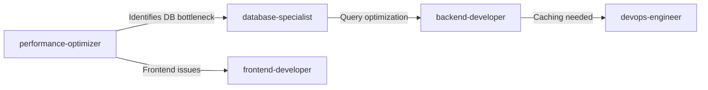
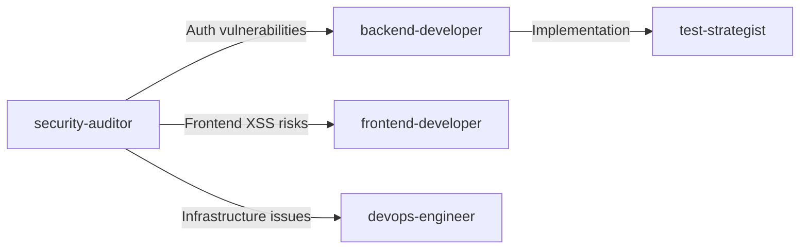

# Full Stack Development Agents

[](/)
[](/)
[](/)

A comprehensive collection of specialized AI agents designed to work together as a complete full-stack development team. Each agent has deep expertise in their domain and knows when to collaborate with other specialists.

## Table of Contents

- [Overview](#overview)
- [Available Agents](#available-agents)
- [How to Use](#how-to-use)
- [Agent Collaboration Examples](#agent-collaboration-examples)
- [Best Practices](#best-practices)
- [Agent Details](#agent-details)

## Overview

These agents form a complete development team, each specializing in different aspects of software development. They're designed to:

- 🎯 Focus on their area of expertise
- 🤝 Know when to defer to other specialists
- 📊 Provide structured, actionable outputs
- 🛠️ Use appropriate tools for each task

## Available Agents

### Core Development Agents

| Agent                     | Purpose                         | Key Skills                                                  |
| ------------------------- | ------------------------------- | ----------------------------------------------------------- |
| **code-quality-analyzer** | Code review & bug fixing        | Bug detection, code smells, best practices, automated fixes |
| **debugger**              | Investigation & troubleshooting | Root cause analysis, error tracing, diagnostic strategies   |
| **test-strategist**       | Testing & quality assurance     | Unit/integration/E2E tests, coverage strategies             |

### Architecture & Design Agents

| Agent                   | Purpose                        | Key Skills                                        |
| ----------------------- | ------------------------------ | ------------------------------------------------- |
| **system-architect**    | System design & architecture   | Scalability, microservices, technology evaluation |
| **api-designer**        | API design & specifications    | REST/GraphQL/gRPC, OpenAPI, versioning strategies |
| **database-specialist** | Database design & optimization | Schema design, query optimization, SQL/NoSQL      |

### Implementation Specialists

| Agent                  | Purpose                 | Key Skills                                        |
| ---------------------- | ----------------------- | ------------------------------------------------- |
| **frontend-developer** | Frontend implementation | React/Vue/Angular, state management, performance  |
| **backend-developer**  | Backend implementation  | APIs, authentication, middleware, background jobs |
| **ui-ux-designer**     | User experience design  | Interface design, accessibility, design systems   |

### Operations & Quality Agents

| Agent                     | Purpose                     | Key Skills                                    |
| ------------------------- | --------------------------- | --------------------------------------------- |
| **devops-engineer**       | Infrastructure & deployment | Docker, Kubernetes, CI/CD, cloud services     |
| **performance-optimizer** | Performance analysis        | Profiling, caching, optimization strategies   |
| **security-auditor**      | Security assessment         | OWASP Top 10, compliance, vulnerability fixes |

### Documentation & Planning Agents

| Agent                        | Purpose                 | Key Skills                                           |
| ---------------------------- | ----------------------- | ---------------------------------------------------- |
| **documentation-specialist** | Technical documentation | API docs, READMEs, guides, code comments             |
| **prp-creator**              | Product requirements    | Feature scoping, acceptance criteria, specifications |

## How to Use

### Basic Usage

```
/invoke-sub-agent [agent-name] "[your request]"
```

### Examples

```bash
# Code review
/invoke-sub-agent code-quality-analyzer "Review my authentication module for bugs and security issues"

# API design
/invoke-sub-agent api-designer "Design a RESTful API for an e-commerce platform"

# Performance analysis
/invoke-sub-agent performance-optimizer "My dashboard takes 10 seconds to load"

# Security audit
/invoke-sub-agent security-auditor "Review my payment processing implementation"
```

## Agent Collaboration Examples

### Example 1: Building a New Feature

```mermaid
graph LR
    A[prp-creator] -->|Requirements| B[system-architect]
    B -->|Architecture| C[api-designer]
    C -->|API Spec| D[database-specialist]
    D -->|Schema| E[backend-developer]
    E -->|API Implementation| F[frontend-developer]
    F -->|UI Implementation| G[test-strategist]
    G -->|Test Suite| H[documentation-specialist]
```



### Example 2: Performance Issue Resolution



### Example 3: Security Review Process



## Best Practices

### 1. Start with the Right Agent

- **New projects**: Start with `prp-creator` → `system-architect`
- **Bug fixing**: Start with `debugger` → `code-quality-analyzer`
- **Performance issues**: Start with `performance-optimizer`
- **Security concerns**: Start with `security-auditor`

### 2. Follow Agent Recommendations

Each agent includes a "When to Defer to Other Agents" section. Follow these recommendations for comprehensive solutions.

### 3. Use Structured Outputs

All agents provide structured reports with:

- Clear problem analysis
- Implementable solutions
- Next steps and recommendations
- References to other agents when needed

### 4. Iterative Development

```
Plan (prp-creator) → Design (architects) → Implement (developers) →
Test (test-strategist) → Optimize (performance/security) → Document
```

## Agent Details

### Code Quality Analyzer

**When to use**: Code review, bug fixing, refactoring, best practices enforcement

**Key outputs**:

- Code quality report with severity levels
- Automated fixes for common issues
- Recommendations for complex problems

**Example output structure**:

```markdown
## Code Quality Report

### Issues Fixed Automatically

- [Issue]: [What was wrong] → [How it was fixed]

### Manual Review Needed

- [Issue]: [Description] → Recommended: [specialist agent]
```

### System Architect

**When to use**: System design, technology decisions, scalability planning

**Key outputs**:

- Architecture diagrams
- Technology recommendations
- Implementation roadmap
- Risk mitigation strategies

**Decision frameworks**:

- Monolith vs Microservices
- SQL vs NoSQL
- Synchronous vs Asynchronous

### Security Auditor

**When to use**: Security reviews, compliance checks, vulnerability assessment

**Key outputs**:

- Vulnerability report by severity
- Concrete security fixes
- Compliance status
- Security testing checklist

**Focus areas**:

- OWASP Top 10
- Authentication/Authorization
- Data encryption
- API security

### Performance Optimizer

**When to use**: Slow performance, high resource usage, optimization needs

**Key outputs**:

- Performance metrics (before/after)
- Optimization implementations
- Caching strategies
- Monitoring setup

**Optimization areas**:

- Frontend (bundle size, rendering)
- Backend (algorithms, queries)
- Database (indexes, query plans)
- Infrastructure (caching, CDN)

## Configuration

Each agent is configured with:

- **name**: Unique identifier
- **description**: When to use the agent with examples
- **tools**: Available tools (Read, Write, Bash, WebSearch, etc.)
- **prompt**: Detailed expertise and methodology

## Contributing

To add a new agent or improve existing ones:

1. Follow the established format:

   ```yaml
   name: agent-name
   description: Clear description with examples
   tools: Tool1, Tool2, Tool3
   ---
   [Agent prompt following the established pattern]
   ```

2. Include:
   - Clear mission statement
   - Process methodology
   - Practical code examples
   - "When to Defer" section
   - Structured output format
   - Best practices checklist

## License

These agent configurations are designed for use with Claude Code and similar AI development assistants.

---

_Remember: Great software is built by great teams. These agents work best when they collaborate, each contributing their expertise to create robust, scalable, and maintainable solutions._
